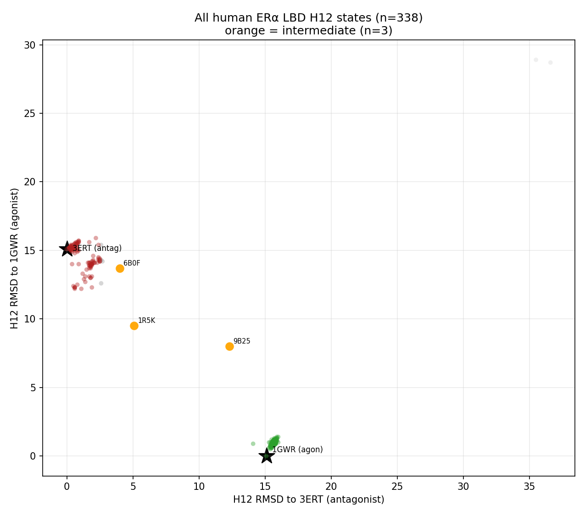
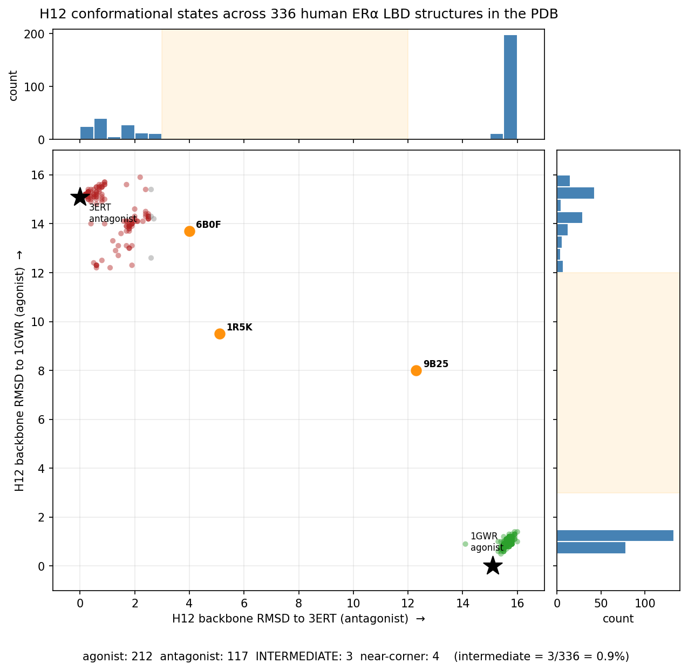
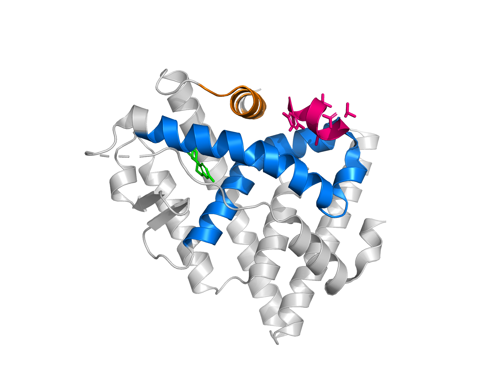
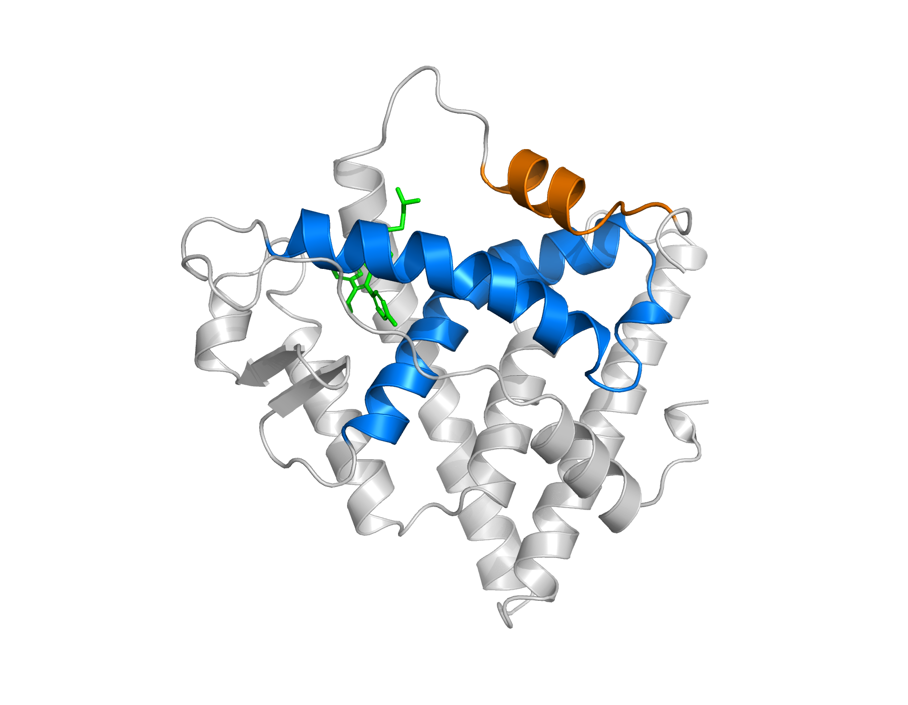

# ERα Helix-12 Conformational-State Analysis

**Methods for measuring the conformational state of a nuclear-receptor switch — structural bioinformatics on the public PDB, plus a reusable state-scoring approach.**

Helix 12 (H12) is the ~11-residue helix that acts as the on/off switch of the estrogen-receptor-α (ERα) ligand-binding domain: in one position it completes the coactivator-binding surface (transcription **ON**), in another it blocks it (**OFF**). This repository is a **methods & skills extract** from a larger study — it contains the *reusable, public-data* pieces: how to census H12 states across every deposited ERα structure, and how to score the H12 state of any structure (a crystal, a predicted model, or an MD frame).

> ⚠️ **This repository is _methodology only._** It deliberately contains **none** of the study's
> molecular-dynamics trajectories, results, or conclusions, and **none** of its simulation pipeline
> or infrastructure. Everything here runs on **public PDB data** and is reusable, general-purpose
> code — it shows *how* the conformational-state analysis is done, not *what* the project found.

---

## What's here

### 1. PDB-wide H12 state census (`scripts/pdb_census/`)
Scan **every** human ERα ligand-binding-domain structure in the PDB, superpose each onto a common rigid core (helices excluding H12), and classify its H12 as **agonist / antagonist / intermediate** by backbone RMSD to reference states. The census quantifies how the structural record is distributed across states — and how rare the off-corner "intermediate" is.




- `sweep_intermediates.py` — score every entry; two-axis map (RMSD-to-agonist × RMSD-to-antagonist).
- `re_examine.py` — per-chain re-scoring (handles asymmetric dimers).
- `reference_map.py` — place the reference structures on the same map.
- `make_h12_histogram.py` — the state distribution with marginals.
- `verify_refs.py` — sequence-verify candidate structures and read their bound ligand.

### 2. H12 conformational-state scoring (`scripts/h12_scoring/`)
Score the H12 state of **any** structure with one consistent method: Kabsch-superpose the ligand-binding-domain core (305–530 Cα, excluding H12), then measure H12 backbone RMSD to the agonist (1GWR) and antagonist (3ERT) references, plus geometric proxies — the E523–D545 opening distance and H12 % helicity. Works identically on crystals, predicted models, and MD snapshots.

<p align="center">
  
  
</p>

*The two states the scorer separates: agonist (left — coactivator peptide bound, H12 clear of the groove) vs antagonist (right — H12 folded into the coactivator groove).*

- `score_h12.py` — the core scorer (superposition + RMSD + geometry proxies).
- `analyze_cofold.py` — apply the scorer to predicted/cofolded structures with pose QC.

---

## Skills demonstrated

**In this repo (runnable on public data):**
- **Structural bioinformatics** — PDB-wide structure mining, sequence verification, ligand parsing, asymmetric-dimer handling.
- **Structural analysis methodology** — Kabsch superposition, robust-core alignment, backbone-RMSD state classification, geometric conformational proxies (`gemmi`).
- **Scientific visualization** — `matplotlib` two-axis maps and distributions; PyMOL structural renders.

**From the broader project (skills applied there — _no code, data, or results from it are in this repo_):**
- **Molecular dynamics** — implicit-solvent conformational sampling and trajectory analysis (`mdtraj`: RMSF, DSSP, contact maps).
- **Structure prediction** — cofolding and ensemble generation (Boltz-2, Chai-1, OpenFold3, BioEmu).
- **Molecular docking** — two-state AutoDock Vina/Vinardo classification + DUD-E benchmarking.
- **Cloud GPU orchestration** — batch job fan-out and data management on Modal.

---

## Repo layout
```
scripts/
  pdb_census/    census H12 states across all public ERα PDB structures
  h12_scoring/   score H12 state of any structure (crystal / predicted / MD frame)
references/      reference crystal structures (1GWR agonist, 3ERT antagonist, 1R5K intermediate, 1ERR)
figures/         result figures on public data
```

## Running it
- **Environment:** [`requirements.txt`](requirements.txt) (`gemmi`, `matplotlib`; PyMOL separately for renders).
- **Data:** `references/` holds the key structures. The full census set is every human-ERα LBD entry in the **public PDB** — downloadable by the accessions the census scripts iterate over; point the scripts at a local mirror to reproduce.
- **Conventions:** ERα is numbered by UniProt **P03372**; H12 = residues **537–547**; the superposition core = **305–530** (excludes H12); E523–R548/D545 opening is a clean state proxy (~10 Å agonist vs ~28–37 Å antagonist).

## Reference states
| PDB | state | ligand |
|---|---|---|
| 1GWR | agonist (closed) | estradiol |
| 3ERT | antagonist (displaced) | 4-hydroxytamoxifen |
| 1R5K | intermediate | GW5638 |
| 1ERR | antagonist | raloxifene |
